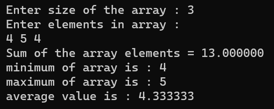

# ARRAYS

## Find The Minimum, Maximum And Average In An Array Of Integers  

### Step-by-Step procedure 
1. Enter The Array Elements.
2. Initialize Max,Min,Sum.
3. Check Each From First Element Whether They Are Greater Than Max Or Not.
   Check Each From First Element Whether They Are Less Than Min Or Not.
4. Perform Summation For Each Array Elements.
5. Calculate Average.
6. Print Max, Min And Avg.
    
###Output Obtained

