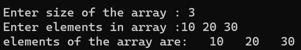

# ARRAYS USING POINTERS

## Read Elements Using Pointer Into Array and Display The Values Using Array  

### Step-by-Step procedure 
1. Read Array Elements.
2. Print Elements.
    
###Output Obtained

