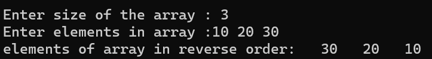

# ARRAYS USING POINTERS

## To Display Elements Of Array In Reverse Order From Array Using Pointer  

### Step-by-Step procedure 
1. Assign Address Of First Element To Pointer Variable.
2. Enter The Size of Array And Array Elements.
3. Assign Last Element Address To pointer To Access The Array In Reverse Order.
4. Print Elements Of Array In Reverse Order.
    
###Output Obtained

