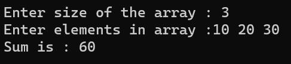

# ARRAYS USING POINTERS

## Program Through Pointer Variable to Sum Of N Elements From Array  

### Step-by-Step procedure 
1. Initialize Sum.
2. Read Array Elements.
3. Assign Ptr To Base Address.
4. Perform Addition For Array Elements Using Pointer.
5. Print Sum. 
    
###Output Obtained

