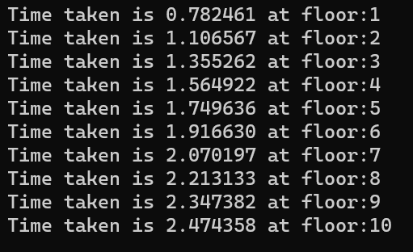

# Calculating Time Using Displacement Formula 

## Calculate Time using Displacement t = sqrt((2*s-2*u*t)/a) 

### Step-by-Step procedure 
1. Time taken to reach each floor 
    
###Output Obtained

