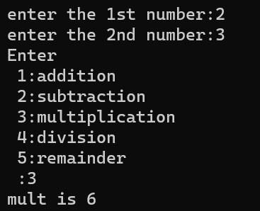

# Operators using Switch Case

## Print the result of the operators using Switch Cash statement 

### Step-by-Step procedure 
1. Addition, Subtraction, Multiplication, Division, Reminder 
    
###Output Obtained

