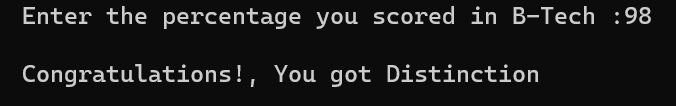

# Class Awarded   

## Class awarded for the given percentage of marks

### Step-by-Step procedure 
1. Marks < 40% = failed 
2. Marks 40% to 60% = Second Class
3. Marks 60% to 70% = First Class
4. Marks >70% = Distinction 
    
###Output Obtained

