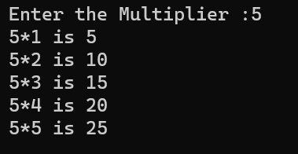

# Multiplication Table  

## Print a multiplication table for a given number and the number of rows in the table

### Step-by-Step procedure 
1. Loop and print individual row in a table
    
###Output Obtained

