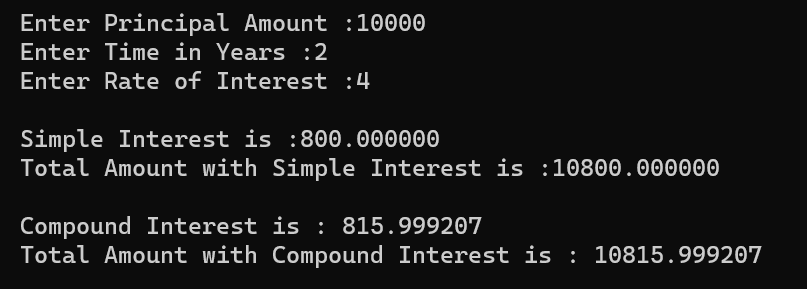

# Simple and Compound Interest  

## Calculate Simple and Compound Interest

### Step-by-Step procedure 
1. Simple Interest (p*t*r)/100
2. Compound Interest p*pow((1+r/100),time)
    
###Output Obtained

