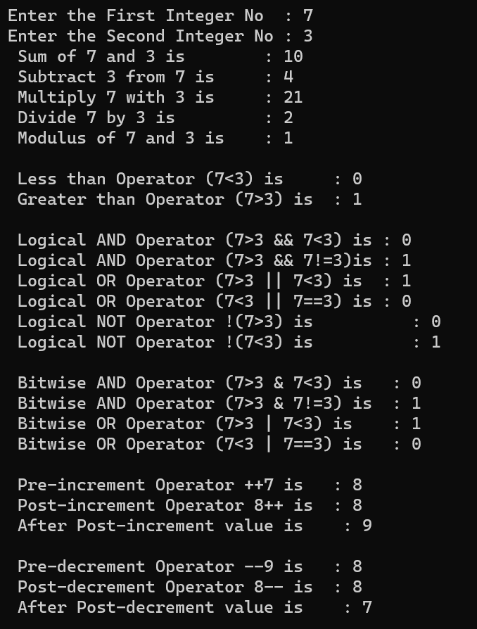

# Operators 

## Print the result of all the operators available in C

### Step-by-Step procedure 
1. Addition, Subtraction, Multiplication, Division, Reminder 
2. Logical AND, OR, NOT
3. Bitwise AND, OR, NOT
4. Pre-increment and Decrement 
5. Post-increment and Decrement
    
###Output Obtained

