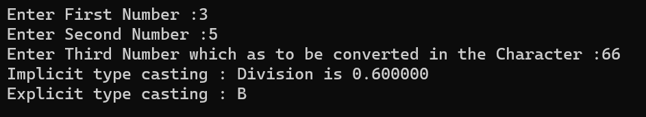

# Type Casting 

## Covert one data type to another data type using auto conversion and casting

### Step-by-Step procedure 
1. Implicit Type Casting
2. Explicit Type Casting
    
###Output Obtained

